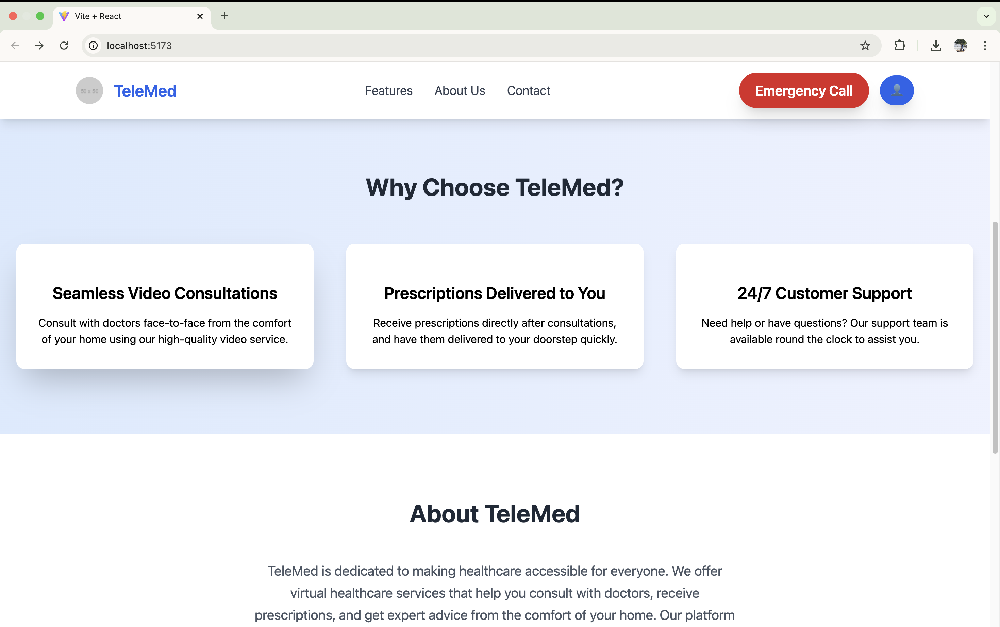
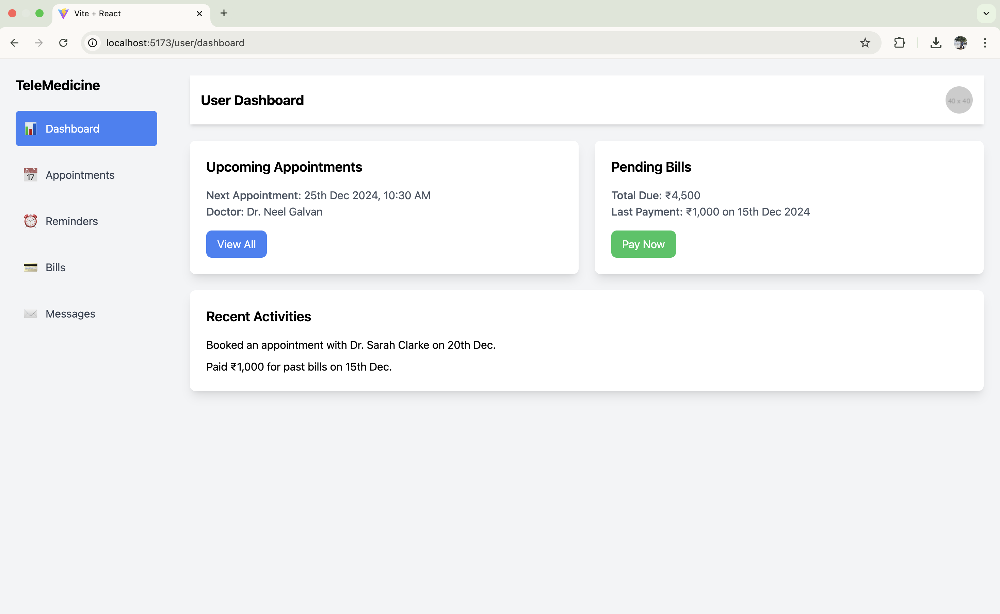
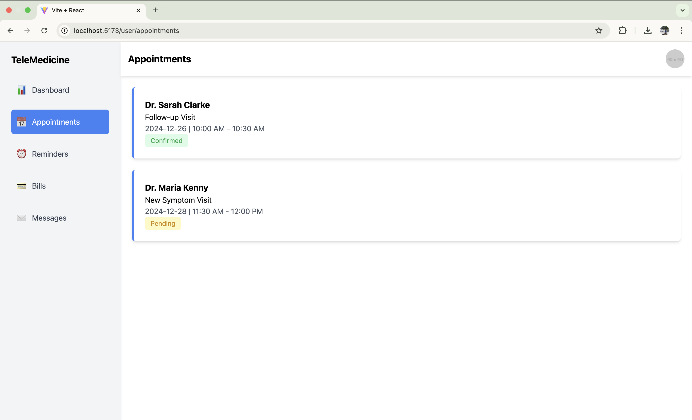
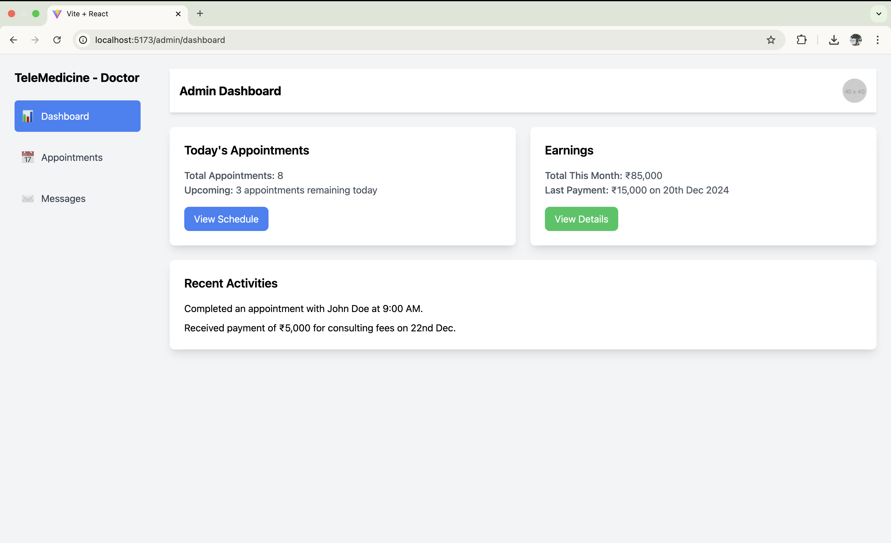
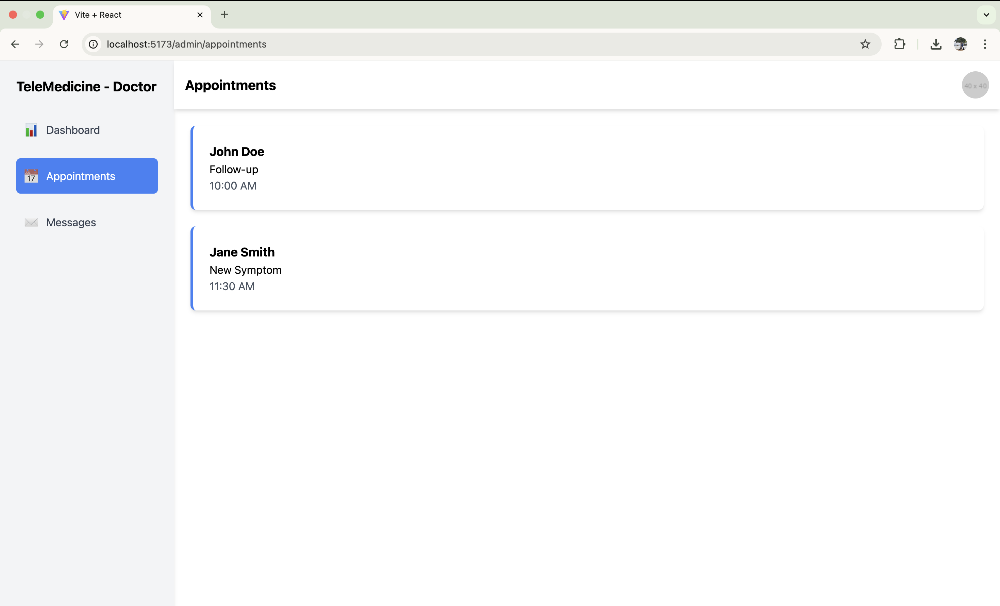

# 🩺 **Telemedicine App**

A comprehensive and user-friendly telemedicine platform designed to revolutionize healthcare access. With this app, patients can seamlessly connect with healthcare providers for consultations, follow-ups, and emergencies—all from the comfort of their homes.

---

## 🌟 **Features at a Glance**

### 🗓️ Appointment Scheduling
- View available slots and book appointments with ease.  
- Real-time updates on doctor availability.  

### 🎥 Video Conferencing
- High-quality video consultations for effective communication.  
- Compatible with all modern devices.  

### 💬 Chat Support
- Instant messaging feature for patients and doctors.  
- Secure and confidential communication.

### 🚨 Emergency Meetings
- Quick access to healthcare providers for urgent medical needs.  

### 💳 Billing and Wallet
- Integrated wallet system for secure and easy payments.  
- View and manage bills with a few clicks.  

### ⏰ Notifications and Reminders
- Automatic reminders for upcoming appointments, prescription refills, and pending bills.  

---

## 🚀 **Technology Stack**

- **Frontend**:  
  - React.js for building an interactive UI.  
  - Vite for fast development and optimized builds.  
  - Tailwind CSS for creating a sleek, modern, and responsive design.  

- **Backend**:  
  - Node.js and Express.js for a robust server-side architecture.  

- **Database**:  
  - MongoDB for scalable and flexible data storage.  

- **Deployment**:  
  - AWS , Vercel

---

## 📸 **Screenshots**

### **Landing Page**
> The entry point of the platform with a modern and attractive design.  
**Screenshot 1:** Overview of the welcome interface.  
  
**Screenshot 2:** Highlights key features and calls to action.  
  

---

### **User Interface**
> A dedicated dashboard and features tailored for the end-users (patients).  
**Screenshot 1:** User dashboard showcasing appointments and wallet.  
  
**Screenshot 2:** Appointment booking and billing features.  
  

---

### **Admin Interface**
> A separate admin panel for doctors to manage appointments and interact with patients.  
**Screenshot 1:** Admin dashboard with detailed analytics and appointment overview.  
  
**Screenshot 2:** Patient management and messaging features.  
  


## 📂 **Project Structure**

```plaintext
📦 telemedicine-app
├── 📁 public          # Static files and assets
├── 📁 src             # Source code for the application
│   ├── 📁 components  # Reusable React components
│   ├── 📁 pages       # Main application pages
│   ├── 📁 utils       # Utility functions and helpers
│   └── 📜 App.js      # Main app entry point
├── 📜 package.json    # Project dependencies and scripts
└── 📜 README.md       # Documentation